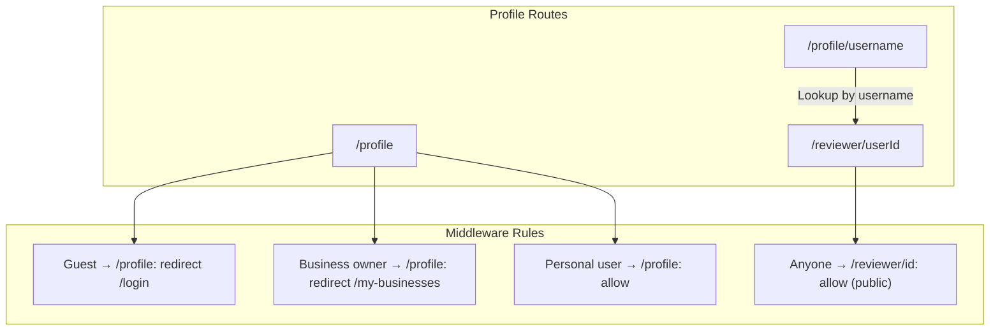

# User Profile vs Reviewer Profile – Edge Case Analysis

## Overview

The app has two distinct profile experiences:

| Route | Purpose | Auth | API | Data Shown |
|-------|---------|------|-----|------------|
| `/profile` | **Own profile** (personal dashboard) | Required | `/api/user/profile`, `/api/user/stats`, etc. | Full profile, saved businesses, own reviews, badges, Edit button |
| `/reviewer/[id]` | **Public reviewer profile** (any user) | Optional | `/api/reviewers/[id]` | Reviews, badges, stats – no saved businesses, no edit |
| `/profile/[username]` | Server redirect | N/A | Server-side lookup | Redirects to `/reviewer/[user_id]` |

---

## Routing & Access Flow

---

## Edge Cases

### 1. Business Owner Who Also Writes Reviews

**Scenario:** User has `account_role: 'business_owner'` and has written reviews.

**Own POV:**
- Visiting `/profile` → middleware redirects to `/my-businesses`. They never see the personal profile UI.
- Visiting `/reviewer/{own-id}` → works. They see their public reviewer profile (reviews, badges). No Edit, no saved businesses. Same as any other visitor.
- **UX gap:** No way to reach the “own profile” experience from nav when in business mode. Header links to `/profile` → redirect.

**Other User POV:**
- Clicks on this user’s ReviewerCard or leaderboard link → goes to `/reviewer/{id}`.
- Sees their reviews, badges, stats. No indication they’re a business owner.

---

### 2. Dual Account (role = `both`) – Role Switcher

**Scenario:** User has `role: 'both'` and can switch between Personal and Business.

**When `account_role: 'user'`:**
- `/profile` → allowed. They see full personal profile.
- `/reviewer/{own-id}` → allowed. Same public view as anyone else.

**When `account_role: 'business_owner'`:**
- `/profile` → redirect to `/my-businesses`.
- To see personal profile: must switch to Personal via RoleSwitcher, then go to `/profile`.

**Other User POV:** Same as case 1 – public reviewer profile only.

---

### 3. ReviewerCard: Own Card While in Business Mode

**Scenario:** Business owner sees their own ReviewerCard (e.g. in community highlights, discover).

**Current behavior:** `ReviewerCard` uses `cardHref = isOwnCard ? '/profile' : '/reviewer/{id}'`. So own card links to `/profile`.

**Result:** Click → `/profile` → middleware redirect → `/my-businesses`. They never land on their reviewer profile.

**Recommendation:** For business owners, own card should link to `/reviewer/{id}` instead of `/profile`, so they always reach their reviewer profile. Or show RoleSwitcher before navigating.

---

### 4. Profile Without Username

**Scenario:** User has `username: null` or empty.

**Sitemap:** `getPublicProfiles` filters `.not('username', 'is', null)` – they are excluded from sitemap.

**`/profile/username`:** `getProfileByUsername` uses `ilike('username', normalized)`. No match → `notFound()`.

**`/reviewer/{id}`:** Works. Reviewer API uses `user_id`, not username.

**Canonical:** `reviewer/[id]/layout.tsx` uses `profile.username ? '/profile/{username}' : '/reviewer/{id}'`. No username → canonical is `/reviewer/{id}`.

---

### 5. Viewing Your Own Reviewer Profile While Logged In

**Scenario:** Logged-in user goes to `/reviewer/{own-id}` (e.g. from leaderboard, shared link).

**Result:** Public reviewer page. No Edit, no “this is you” badge, no saved businesses. Same layout as viewing someone else.

**Consideration:** Optional “View full profile” / “Edit profile” link when `currentUser.id === reviewerId` could improve UX and navigation to `/profile`.

---

### 6. Business Owner Profile in Sitemap

**Scenario:** Business owner has `username` and `reviews_count > 0`.

**Sitemap:** Included (sitemap only checks username + reviews_count).

**`/profile/{username}`:** Redirects to `/reviewer/{user_id}`. Works.

**`/reviewer/{id}`:** Accessible. Their public reviewer profile is indexable.

---

### 7. Deactivated or Missing Profile

**Scenario:** `profiles.deactivated_at` set, or profile row missing.

**`/api/user/profile`:** Returns 404 if no profile. Page can handle with fallbacks.

**`/api/reviewers/[id]`:** Uses service role, fetches by `user_id`. No `deactivated_at` filter found – deactivated users may still have a public reviewer profile. Potential data leak.

**Recommendation:** Add `deactivated_at` (or equivalent) filter in reviewer API when returning profile data.

---

### 8. Privacy: Own Profile vs Reviewer Profile

**Own profile (`/profile`):**
- Shows saved businesses (if any).
- Can hide sections via `privacy_settings` (e.g. `showSavedBusinesses`).

**Reviewer profile (`/reviewer/[id]`):**
- Does not expose saved businesses.
- No privacy toggles – it’s a fixed public view.
- Reviews and badges are always shown.

**Edge case:** User sets `showSavedBusinesses: false` on own profile. Saved businesses are hidden there, but reviewer profile never showed them anyway.

---

### 9. Anonymous Reviews

**Scenario:** Reviews submitted without login use `anonymous_id`.

**Reviewer API:** Fetches with `.eq('user_id', userId)`. Anonymous reviews (`user_id = null`) are not included.

**Result:** Anonymous reviews do not appear on any user’s reviewer profile. Correct.

---

### 10. Links to Profiles Across the App

| Source | Link | Notes |
|--------|------|-------|
| ReviewerCard (own) | `/profile` | Business owner → redirect to `/my-businesses` |
| ReviewerCard (other) | `/reviewer/{id}` | Works |
| LeaderboardUser | `/reviewer/{user.id}` | Always reviewer page |
| Header nav | `/profile` | Business owner → redirect |
| Achievements | `/profile` | Business owner → redirect |
| Sitemap | `/profile/{username}` | Redirects to `/reviewer/{id}` |

---

## Summary: What Each User Sees

| Actor | `/profile` | `/reviewer/{id}` (other) | `/reviewer/{id}` (self) |
|-------|------------|---------------------------|--------------------------|
| Guest | Redirect to /login | Full public view | N/A (not logged in) |
| Personal user | Full personal profile | Full public view | Public view (no edit) |
| Business owner | Redirect to /my-businesses | Full public view | Public view only |
| Business owner (role=both, switched to Personal) | Full personal profile | Full public view | Public view (no edit) |

---

## Recommendations

1. **ReviewerCard for business owners:** When `isOwnCard` and `account_role === 'business_owner'`, link to `/reviewer/{id}` instead of `/profile`.
2. **Reviewer page when viewing self:** Add conditional “Edit profile” or “View full profile” when `currentUser?.id === reviewerId` and user is not a business owner.
3. **Reviewer API:** Filter out deactivated profiles (`deactivated_at IS NULL`) to avoid exposing them publicly.
4. **RoleSwitcher visibility:** Ensure RoleSwitcher is visible in contexts where business owners might want to reach `/profile` (e.g. header when on /my-businesses or /home).
