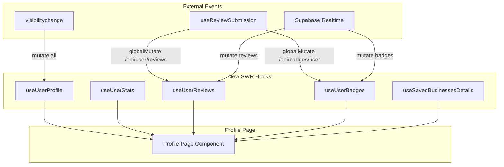

# Profile Page SWR Optimization Spec

## Overview

Replace the profile page's raw fetch/useEffect pattern with SWR hooks following the project's existing patterns: deduping, visibility-based refetch, structured keys, and optional deferred loading. This will reduce load times via caching, parallel fetching, and stale-while-revalidate.

---

## Current State

The profile page (`src/app/profile/page.tsx`) uses **5 separate useEffects** with raw `fetch` calls:

- `/api/user/profile` (profile details)
- `/api/user/stats` (stats)
- `/api/saved/businesses?limit=20&page=1` (saved businesses with full objects)
- `/api/user/reviews?page=1&pageSize=20` (user's reviews)
- `/api/badges/user?user_id=X` (badges/achievements)

**Problems:**

- No caching — every visit refetches everything
- No deduplication — multiple components could trigger duplicate requests
- Visibility handler sets loading to `true` but **never triggers refetch** (effects only depend on `user?.id`, so returning to tab shows spinners indefinitely)
- 5 independent fetches — no coordination; waterfall/race dependent on effect order
- No integration with `useReviewSubmission` — profile reviews/badges don't update when user posts a review elsewhere
- Realtime subscriptions use raw fetch instead of cache invalidation

---

## Architecture

---

## Implementation

### 1. Create `useUserProfile` hook

**File:** `src/app/hooks/useUserProfile.ts` (new)

- SWR key: `['/api/user/profile', userId]` when `user?.id` is set, else `null`
- Fetcher: `GET /api/user/profile`, returns `result.data` (EnhancedProfile)
- Config: `dedupingInterval: 60_000`, `revalidateOnFocus: false`
- Expose: `{ profile, loading, error, mutate }`
- On `visibilitychange` (when document becomes visible): call `mutate()` to refetch

### 2. Create `useUserStats` hook

**File:** `src/app/hooks/useUserStats.ts` (new)

- SWR key: `['/api/user/stats', userId]` when `user?.id`, else `null`
- Fetcher: `GET /api/user/stats`, returns `result.data`
- Config: `dedupingInterval: 60_000`
- On visibility: `mutate()`

### 3. Create `useUserReviews` hook

**File:** `src/app/hooks/useUserReviews.ts` (new)

- SWR key: `['/api/user/reviews', userId, page, pageSize]` — e.g. `(userId, 1, 20)`
- Fetcher: `GET /api/user/reviews?page=1&pageSize=20`, transform to `Review[]` (same shape as current)
- Config: `dedupingInterval: 30_000`
- On visibility: `mutate()`
- **Integration:** In `useReviewSubmission` (`src/app/hooks/useReviews.ts`), add `globalMutate` for keys matching `/api/user/reviews` when a review is submitted or deleted, so the profile page updates without a manual refresh

### 4. Create `useUserBadges` hook

**File:** `src/app/hooks/useUserBadges.ts` (new)

- SWR key: `['/api/badges/user', userId]` when `user?.id`, else `null`
- Fetcher: `GET /api/badges/user?user_id=X`, transform to `UserAchievement[]`
- Config: `dedupingInterval: 60_000`
- On visibility: `mutate()`
- **Realtime:** Keep Supabase subscription in profile (or move to hook); on `user_badges` INSERT, call `mutate()` instead of raw fetch
- **Integration:** `useReviewSubmission` already invalidates `/api/badges/user` via `globalMutate` — no change needed

### 5. Create `useSavedBusinessesDetails` hook

**File:** `src/app/hooks/useSavedBusinessesDetails.ts` (new)

- SWR key: `['/api/saved/businesses', userId, limit, page]` — e.g. `(userId, 20, 1)` when `user?.id` and `savedItems.length > 0`, else `null`
- Fetcher: `GET /api/saved/businesses?limit=20&page=1`, returns `data.businesses`
- Config: `dedupingInterval: 30_000`
- On visibility: `mutate()`
- **Integration:** When `SavedItemsContext` mutates (add/remove save), invalidate this cache: `globalMutate(key => key[0] === '/api/saved/businesses' && key[2] === 20)`

### 6. Shared visibility refetch pattern

Each hook listens to `document.visibilitychange` and calls `mutate()` when the tab becomes visible. Use the same pattern as `useBusinesses` / `useFeaturedBusinesses` — avoid global `revalidateOnFocus` and handle it manually per hook for control.

### 7. Profile page refactor

**File:** `src/app/profile/page.tsx`

- Replace all 5 fetch useEffects with the 5 new hooks
- Remove `refreshTriggerRef`, `profileLoading`, `statsLoading`, etc. — use `loading` from each hook
- Derive `profile` (merged UserProfile) from `user?.profile` + `useUserProfile().profile`; handle 404/null as today
- Realtime subscriptions: on badges INSERT → `mutate()` from `useUserBadges`; on reviews change → `mutate()` from `useUserReviews` (remove raw fetch, remove `setAchievementsLoading`/`setReviewsLoading`)
- Remove debug `console.log` calls
- Keep skeletons; show them when `loading` from each section's hook

### 8. Optional: Deferred loading for below-fold sections

Following `useFeaturedBusinesses` `deferMs` pattern:

- Profile header + stats: fetch immediately
- Reviews, achievements, saved businesses: pass `deferMs: 150` or use `requestIdleCallback` to delay SWR key until after first paint, so above-fold content loads first

---

## Deduping / Revalidation Summary

| Hook                      | dedupingInterval | Visibility refetch |
| ------------------------- | ---------------- | ------------------ |
| useUserProfile            | 60s              | yes                |
| useUserStats              | 60s              | yes                |
| useUserReviews            | 30s              | yes                |
| useUserBadges             | 60s              | yes                |
| useSavedBusinessesDetails | 30s              | yes                |

---

## Cache Invalidation (globalMutate)

| Event                        | Keys to invalidate                                     |
| ---------------------------- | ------------------------------------------------------ |
| Review submitted             | `/api/user/reviews`, `/api/badges/user` (already done) |
| Review deleted               | `/api/user/reviews`                                    |
| Saved item added/removed     | `/api/saved/businesses` (details variant)              |
| Realtime: user_badges INSERT | `useUserBadges` mutate (local)                         |
| Realtime: reviews change     | `useUserReviews` mutate (local)                        |

---

## Load Time Benefits

1. **Stale-while-revalidate:** Returning users see cached data instantly, then background refresh
2. **Parallel fetches:** SWR fires all 5 in parallel (no effect dependency chains)
3. **Deduplication:** Same profile data requested from multiple places = one request
4. **Correct visibility refetch:** Tab return actually triggers `mutate()`, fixing the current bug
5. **Optional defer:** Below-fold sections can delay first fetch to improve LCP
